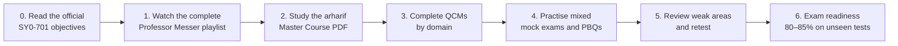

<div align="center">

# 🛡️ CompTIA Security+ SY0-701  
## From Cybersecurity Foundations to Exam Readiness

**A structured, practical, and exam-aligned learning roadmap for building real cybersecurity knowledge—not merely memorising answers.**

[](https://www.comptia.org/en-us/certifications/security/)
[](#-recommended-learning-roadmap)
[](#-free-qcm-and-mock-exam-platforms)
[](https://arharif.github.io/)

<br>

> **Learn the concepts. Understand the architecture. Apply the controls. Analyse the scenarios. Pass the exam.**

</div>

---

## 📌 About This Repository

This repository provides a mature learning path for the **CompTIA Security+ SY0-701** certification.

Its purpose is not limited to helping candidates pass an examination. It is designed to help learners build a solid cybersecurity foundation that can later support work in:

- Security Operations Centre — SOC
- Governance, Risk and Compliance — GRC
- Incident Response
- Cloud and Infrastructure Security
- Identity and Access Management — IAM
- Vulnerability Management
- Security Engineering
- Cybersecurity Management and CISO functions

The roadmap follows a deliberate sequence:

1. **Watch** the complete Professor Messer video course.
2. **Deepen** every concept using the arharif Security+ Master Course.
3. **Practise** with legitimate QCMs, scenario questions, and PBQ-style exercises.
4. **Analyse** every incorrect or uncertain answer.
5. **Simulate** the real examination under strict timing conditions.

> [!IMPORTANT]
> This is an independent educational repository. It is not affiliated with, endorsed by, or sponsored by CompTIA.  
> It does **not** provide leaked examination questions, brain dumps, or unauthorised exam content.

---

## 🎯 Learning Outcomes

By completing this roadmap, you should be able to:

- Explain the five Security+ domains in your own words.
- Recognise common cyber threats, vulnerabilities, and indicators of compromise.
- Select appropriate preventive, detective, corrective, and compensating controls.
- Understand secure enterprise, cloud, network, identity, and data architectures.
- Analyse logs, alerts, incidents, vulnerabilities, and remediation priorities.
- Connect technical security controls with governance, risk, compliance, and business objectives.
- Answer scenario-based QCMs by identifying the **best**, **first**, or **most appropriate** action.
- Approach performance-based questions methodically.
- Demonstrate practical cybersecurity judgement instead of relying on memorisation.

---

## 🧭 Recommended Learning Roadmap



### The correct order

| Phase | Resource | Objective |
|---|---|---|
| **0 — Scope** | Official SY0-701 Exam Objectives | Understand exactly what CompTIA may assess. |
| **1 — Foundation** | Professor Messer video playlist | Build a clear first understanding of every objective. |
| **2 — Deep Learning** | arharif Security+ Master Course PDF | Study concepts, examples, operational context, and explanations in depth. |
| **3 — Reinforcement** | Topic-based QCMs | Confirm understanding one domain at a time. |
| **4 — Application** | Mixed mock exams and PBQs | Practise scenario analysis, timing, and decision-making. |
| **5 — Remediation** | Error log and targeted revision | Repair weak areas rather than repeatedly taking random tests. |
| **6 — Validation** | New timed mock examinations | Confirm readiness using unseen questions. |

---

## 🚀 Start Here

### 1️⃣ Complete the Professor Messer SY0-701 Course

[](https://www.youtube.com/watch?v=KiEptGbnEBc&list=PLG49S3nxzAnl4QDVqK-hOnoqcSKEIDDuv)

**Recommended method**

- Watch the playlist in order.
- Do not skip topics because they appear familiar.
- Record only short notes during the first pass.
- Write one practical example for every important concept.
- Mark unclear objectives as **Red**, partially understood objectives as **Amber**, and mastered objectives as **Green**.
- Do not begin full mock exams before completing the conceptual foundation.

### 2️⃣ Deepen Your Knowledge with the arharif Master Course

[](./resources/Security_Plus_SY0-701_Master_Course_arharif.pdf)

The PDF should be stored at:

```text
resources/Security_Plus_SY0-701_Master_Course_arharif.pdf
```

Use the handbook after completing the video course to:

- Revisit every Security+ objective in greater depth.
- Connect definitions to realistic enterprise scenarios.
- Understand the perspectives of analysts, engineers, GRC teams, and CISOs.
- Review end-of-section questions and explanations.
- Identify why an answer is correct and why the alternatives are incorrect.
- Build knowledge that remains useful after the certification exam.

### 3️⃣ Keep the Official Blueprint Open

[](https://www.examcompass.com/comptia-certifications/security-plus/comptia-security-plus-sy0-701-exam-objectives.pdf)

Use the official objectives as a checklist. A course is complete only when you can explain each listed objective without depending on notes.

---

## 🧩 Security+ Exam Snapshot

| Item | SY0-701 |
|---|---|
| **Exam code** | SY0-701 |
| **Maximum questions** | 90 |
| **Question formats** | Multiple-choice, multiple-response, and performance-based questions |
| **Duration** | 90 minutes |
| **Passing score** | 750 on a scale of 100–900 |
| **Primary goal** | Validate practical, vendor-neutral cybersecurity knowledge and judgement |

> [!NOTE]
> Always verify the current exam details and policies on the official CompTIA website before purchasing or scheduling an exam.

---

# 🏛️ The Five Security+ Domains

| Domain | Weight | Main Question |
|---|---:|---|
| **1. General Security Concepts** | **12%** | What principles and controls form the foundation of cybersecurity? |
| **2. Threats, Vulnerabilities, and Mitigations** | **22%** | What can attack the organisation, where are the weaknesses, and how should they be reduced? |
| **3. Security Architecture** | **18%** | How should secure and resilient systems, networks, cloud services, and data flows be designed? |
| **4. Security Operations** | **28%** | How do security teams prevent, detect, investigate, respond to, and recover from incidents? |
| **5. Security Program Management and Oversight** | **20%** | How does an organisation govern cybersecurity, risk, compliance, vendors, awareness, and assurance? |

---

<details>
<summary><strong>Domain 1 — General Security Concepts · 12%</strong></summary>

<br>

### Purpose

This domain establishes the language and fundamental logic of cybersecurity. It explains what security is trying to protect, how controls are classified, how trust is managed, and why cryptography and change management matter.

### Core subjects

- Technical, managerial, operational, and physical controls
- Preventive, deterrent, detective, corrective, compensating, and directive controls
- Confidentiality, Integrity, and Availability — CIA
- Authentication, Authorization, and Accounting — AAA
- Non-repudiation
- Zero Trust principles
- Gap analysis
- Physical security and deception technologies
- Change management
- Symmetric and asymmetric encryption
- Hashing, salting, digital signatures, and certificates
- Public Key Infrastructure — PKI
- TPM, HSM, key management, tokenisation, masking, and obfuscation

### Simple example

A company protects its payroll database through:

- **Confidentiality:** only authorised HR staff can read salaries.
- **Integrity:** unauthorised salary changes are detected and rejected.
- **Availability:** payroll remains accessible during the payment period.
- **Authentication:** the system verifies the employee's identity.
- **Authorisation:** the system determines which records the employee may access.
- **Accounting:** the system records who viewed or changed each record.

### Real-world perspective

A SOC analyst sees alerts and evidence.  
A security engineer designs and deploys controls.  
A GRC professional verifies that controls meet requirements.  
A CISO ensures that the combined control environment reduces business risk.

### Evidence of mastery

You should be able to:

- Classify a control by category and function.
- Distinguish authentication from authorisation.
- Explain encryption, hashing, and digital signatures without confusing them.
- Describe how PKI establishes trust.
- Explain why uncontrolled changes create security incidents.
- Select the most appropriate cryptographic solution for a scenario.

</details>

---

<details>
<summary><strong>Domain 2 — Threats, Vulnerabilities, and Mitigations · 22%</strong></summary>

<br>

### Purpose

This domain explains who attacks systems, why they attack, how they enter, which weaknesses they exploit, what indicators they leave, and which mitigations reduce the risk.

### Core subjects

- Nation-state, criminal, insider, hacktivist, and unskilled threat actors
- Threat actor motivations and capabilities
- Email, SMS, voice, file, image, removable-media, wireless, and supply-chain vectors
- Phishing, smishing, vishing, pretexting, impersonation, and business email compromise
- Application, operating-system, hardware, cloud, mobile, virtualisation, and cryptographic vulnerabilities
- SQL injection, cross-site scripting, buffer overflow, race conditions, and directory traversal
- Ransomware, trojans, worms, spyware, rootkits, keyloggers, and logic bombs
- DDoS, DNS, wireless, on-path, replay, password, and cryptographic attacks
- Indicators of compromise and suspicious behaviour
- Segmentation, isolation, patching, hardening, monitoring, access control, and least privilege

### Simple example

An employee receives an urgent message appearing to come from the CEO and requesting an immediate bank transfer.

The security problem is not merely “a bad email.” It may involve:

1. Brand or executive impersonation
2. Social engineering and urgency
3. Possible account compromise
4. Weak payment verification procedures
5. Insufficient awareness training
6. Missing email authentication or monitoring controls

A mature mitigation combines people, process, and technology.

### Evidence of mastery

You should be able to:

- Differentiate a threat, vulnerability, exploit, risk, and control.
- Match threat actors with likely motivations.
- Recognise attack indicators from a scenario or log extract.
- Select the most effective mitigation instead of the most expensive control.
- Distinguish prevention from detection and response.
- Explain why patching alone does not eliminate every vulnerability.

</details>

---

<details>
<summary><strong>Domain 3 — Security Architecture · 18%</strong></summary>

<br>

### Purpose

This domain focuses on designing secure, resilient, and recoverable technology environments. It connects business requirements to network, cloud, infrastructure, identity, and data protection decisions.

### Core subjects

- On-premises, cloud, hybrid, serverless, microservices, and Infrastructure as Code
- Virtualisation, containers, IoT, ICS, SCADA, RTOS, and embedded systems
- High availability, scalability, resilience, recovery, and cost
- Segmentation, security zones, jump servers, proxies, IDS/IPS, load balancers, and sensors
- Firewalls, WAFs, NGFWs, and UTM appliances
- VPN, TLS, IPsec, SD-WAN, and SASE
- Fail-open and fail-closed decisions
- Data types, classification, sovereignty, geolocation, and lifecycle
- Data at rest, in transit, and in use
- Encryption, hashing, masking, tokenisation, obfuscation, and access restrictions
- Backups, replication, clustering, load balancing, and disaster recovery

### Simple example

A payment platform cannot rely on one firewall and one database server.

A resilient architecture may include:

- Network segmentation between public, application, and database zones
- A WAF in front of public web applications
- Strong identity controls for administrators
- Encryption for sensitive data in transit and at rest
- Central logging and monitoring
- Redundant services across availability zones
- Tested backups and documented recovery objectives
- Controlled third-party and remote access

Security architecture is the planned arrangement of these protections—not a random collection of tools.

### Evidence of mastery

You should be able to:

- Select the right control placement for a scenario.
- Explain shared responsibility in cloud environments.
- Distinguish high availability from backup and disaster recovery.
- Match data states with appropriate protections.
- Explain segmentation, isolation, and Zero Trust architecture.
- Analyse the security trade-offs of cloud, virtualisation, containers, IoT, and legacy systems.

</details>

---

<details>
<summary><strong>Domain 4 — Security Operations · 28%</strong></summary>

<br>

### Purpose

This is the largest Security+ domain. It explains how security is operated every day: hardening, monitoring, vulnerability management, identity administration, alert investigation, incident response, automation, and recovery.

### Core subjects

- Secure baselines, hardening, patching, and configuration management
- Wireless, mobile, application, cloud, and endpoint security
- Asset inventory and lifecycle management
- Vulnerability scanning, analysis, prioritisation, remediation, and validation
- SIEM, SOAR, EDR, DLP, IDS/IPS, firewalls, and network monitoring
- Logs, alerts, dashboards, packet captures, and metadata
- Identity provisioning, deprovisioning, federation, SSO, MFA, PAM, and access reviews
- Automation and orchestration
- Incident response preparation, detection, analysis, containment, eradication, recovery, and lessons learned
- Digital forensics, evidence collection, chain of custody, and legal hold
- Backups, restoration, continuity, and recovery testing

### Simple example

An EDR alert reports PowerShell launching an encoded command on an executive laptop.

A mature analyst does not immediately wipe the device. The analyst should:

1. Validate the alert and gather context.
2. Determine whether the activity is authorised.
3. Review process trees, network connections, users, and related alerts.
4. Assess the scope and potential business impact.
5. Contain the endpoint when justified.
6. Preserve relevant evidence.
7. Eradicate the cause and recover safely.
8. Document the incident and improve controls.

### Evidence of mastery

You should be able to:

- Interpret common security logs and alerts.
- Prioritise vulnerabilities using technical and business context.
- Describe the complete incident response lifecycle.
- Distinguish containment from eradication and recovery.
- Explain identity lifecycle and privileged-access controls.
- Choose appropriate monitoring, endpoint, network, and data security tools.
- Preserve evidence and maintain chain of custody.

</details>

---

<details>
<summary><strong>Domain 5 — Security Program Management and Oversight · 20%</strong></summary>

<br>

### Purpose

This domain connects cybersecurity to governance and business management. It explains how organisations define expectations, manage risk, oversee third parties, maintain compliance, educate people, and validate control effectiveness.

### Core subjects

- Policies, standards, procedures, guidelines, and governance structures
- Roles, responsibilities, accountability, and segregation of duties
- Risk identification, assessment, analysis, treatment, acceptance, transfer, and avoidance
- Risk registers, appetite, tolerance, likelihood, impact, and key risk indicators
- Business impact analysis
- Third-party risk, contracts, due diligence, monitoring, and offboarding
- Compliance, privacy, legal, regulatory, and contractual requirements
- Internal and external audits
- Attestation, certification, penetration testing, and control assessments
- Security awareness, phishing simulations, role-based training, and culture
- Business continuity, disaster recovery, and crisis management
- Exceptions, compensating controls, and risk acceptance

### Simple example

A critical legacy system cannot support MFA.

A mature organisation should not simply ignore the requirement. It should:

1. Document the control gap.
2. Assess likelihood and business impact.
3. Identify feasible compensating controls.
4. Assign a risk owner.
5. Approve a time-limited exception.
6. Monitor the residual risk.
7. Create a remediation or replacement roadmap.
8. Review the exception before it expires.

### Evidence of mastery

You should be able to:

- Distinguish policies, standards, procedures, and guidelines.
- Calculate and interpret basic quantitative risk values.
- Explain risk appetite, tolerance, inherent risk, and residual risk.
- Select appropriate third-party controls throughout the supplier lifecycle.
- Distinguish audits, assessments, attestations, and penetration tests.
- Connect cybersecurity decisions to business objectives and accountability.

</details>

---

## 🧠 The arharif Learning Method

Use the following cycle for every objective:

```text
LEARN → EXPLAIN → APPLY → TEST → REVIEW → RETEST
```

### 1. Learn

Watch the relevant video and read the corresponding section of the handbook.

### 2. Explain

Explain the concept aloud without looking at notes.

A strong explanation should answer:

- What is it?
- Why does it exist?
- What risk does it address?
- How does it work?
- When should it be used?
- What are its limitations?
- With which similar concept could it be confused?

### 3. Apply

Create a practical scenario.

Example:

> A remote administrator requires access to production servers. Which controls should protect this access, and why?

A mature response may include MFA, PAM, a jump server, a VPN or Zero Trust access, session recording, least privilege, approval workflows, monitoring, and periodic access review.

### 4. Test

Complete topic-based QCMs before moving to mixed mock exams.

### 5. Review

Maintain an error log for:

- Incorrect answers
- Correct answers based on guessing
- Confused terminology
- Missed scenario keywords
- Weak objectives
- Time-management problems

### 6. Retest

Return to the corresponding objective, explain it again, and complete a new question set.

---

# 📝 Free QCM and Mock-Exam Platforms

Use only legitimate practice resources. Questions should help you learn the objectives—not reproduce protected live examination content.

| Platform | Free Resource | Best Use | Recommended Stage |
|---|---|---|---|
| **Professor Messer Study Groups** | [Open the replay library](https://www.professormesser.com/security-plus/sy0-701/sy0-701-study-group/sy0-701-security-study-group-replays/) | Scenario questions with detailed instructor reasoning | During and after the video course |
| **Professor Messer Pop Quizzes** | [Open SY0-701 pop quizzes](https://www.professormesser.com/category/security-plus/sy0-701/sy0-701-pop-quiz/) | Frequent short QCM practice | Daily reinforcement |
| **ExamCompass** | [Open free SY0-701 practice tests](https://www.examcompass.com/comptia/security-plus-certification/free-security-plus-practice-tests) | Topic quizzes, acronym tests, and repeated recall | After each domain |
| **Crucial Exams** | [Open SY0-701 practice materials](https://crucialexams.com/exams/comptia/security/sy0-701/practice-tests-practice-questions) | Free short tests, explanations, flashcards, and PBQ previews | After completing the handbook |
| **Professor Messer Course Index** | [Open the free course index](https://www.professormesser.com/security-plus/sy0-701/sy0-701-video/sy0-701-comptia-security-plus-course/) | Find lessons by exact exam objective | Targeted remediation |

> [!TIP]
> Do not evaluate readiness using questions you have memorised. Your most meaningful score comes from a **new, unseen, timed test**.

---

## 🎯 How to Use Practice Questions Correctly

For each question:

1. Identify whether it asks for the **best**, **first**, **next**, **most likely**, or **most secure** answer.
2. Separate relevant facts from distracting information.
3. Determine the underlying domain and objective.
4. Eliminate answers that are technically true but do not solve the stated problem.
5. Select the answer that best matches the requested priority.
6. Review the explanation even when your answer is correct.
7. Record uncertain answers in your error log.

### Example reasoning pattern

**Question:** A company detects active ransomware encryption on several endpoints. What should the security team do first?

Do not immediately choose “restore from backup” simply because backups are important.

The first operational priority is usually to **contain the spread**, for example by isolating affected systems. Restoration belongs to the recovery phase after containment and eradication decisions.

Security+ frequently assesses the **correct sequence of actions**, not only definitions.

---

## 📊 Recommended Score Targets

| Stage | Target | Interpretation |
|---|---:|---|
| First topic quiz | **60–70%** | Normal during initial learning |
| Domain review | **75–80%** | Foundation is becoming reliable |
| New mixed mock exam | **80–85%** | Strong readiness indicator |
| Repeated test | Not reliable alone | The score may reflect memorisation |
| Guessed answer | Count as incorrect | Understanding is not yet proven |

> [!CAUTION]
> No practice-test percentage guarantees a pass. Use scores as evidence of strengths and weaknesses, not as a promise.

---

# 📅 Eight-Week Study Plan

## Week 1 — Domain 1: General Security Concepts

- [ ] Watch Domain 1 videos.
- [ ] Review security control categories and types.
- [ ] Master CIA, AAA, Zero Trust, and non-repudiation.
- [ ] Study change management.
- [ ] Study cryptography and PKI.
- [ ] Complete Domain 1 handbook questions.
- [ ] Complete topic-based QCMs.
- [ ] Record weak concepts.

## Week 2 — Domain 2: Threat Actors and Attack Surfaces

- [ ] Study threat actors, attributes, and motivations.
- [ ] Study threat vectors and social engineering.
- [ ] Create examples for phishing, smishing, vishing, BEC, and pretexting.
- [ ] Complete targeted QCMs.
- [ ] Explain threat versus vulnerability versus risk.

## Week 3 — Domain 2: Vulnerabilities, Attacks, and Mitigations

- [ ] Study application, web, cloud, mobile, hardware, and virtualisation vulnerabilities.
- [ ] Study malware, network, password, and cryptographic attacks.
- [ ] Identify indicators of malicious activity.
- [ ] Map each attack to appropriate mitigations.
- [ ] Complete Domain 2 handbook questions and QCMs.

## Week 4 — Domain 3: Security Architecture

- [ ] Study cloud, hybrid, virtualisation, containers, IoT, ICS, and embedded systems.
- [ ] Study segmentation, firewalls, WAF, IDS/IPS, VPN, SASE, and secure access.
- [ ] Study data classification, states, sovereignty, and protection.
- [ ] Study resilience, backups, redundancy, and recovery.
- [ ] Complete Domain 3 questions and QCMs.

## Week 5 — Domain 4: Security Operations

- [ ] Study hardening, secure baselines, patching, and asset management.
- [ ] Study vulnerability management.
- [ ] Study SIEM, SOAR, EDR, DLP, IDS/IPS, and logs.
- [ ] Study IAM, MFA, SSO, federation, and PAM.
- [ ] Study incident response and digital forensics.
- [ ] Complete Domain 4 questions and QCMs.

## Week 6 — Domain 5: Governance, Risk, and Oversight

- [ ] Study policies, standards, procedures, and guidelines.
- [ ] Study qualitative and quantitative risk.
- [ ] Study vendor and third-party risk.
- [ ] Study compliance, privacy, audits, and assessments.
- [ ] Study awareness, continuity, disaster recovery, and crisis management.
- [ ] Complete Domain 5 questions and QCMs.

## Week 7 — Mixed Practice and PBQs

- [ ] Complete mixed-domain practice tests.
- [ ] Practise PBQ-style scenarios.
- [ ] Review network diagrams, firewall rules, logs, and incident sequences.
- [ ] Revisit every Red or Amber objective.
- [ ] Build an acronym revision sheet.
- [ ] Explain every incorrect answer.

## Week 8 — Final Validation

- [ ] Complete at least three new timed mock exams.
- [ ] Use a 90-minute limit.
- [ ] Practise skipping and returning to difficult questions.
- [ ] Review only weak areas—not the entire course again.
- [ ] Confirm identity documents, exam rules, location, and technical requirements.
- [ ] Rest properly before the exam.

---

## ✅ Master Progress Tracker

### Foundation

- [ ] I downloaded and reviewed the official SY0-701 objectives.
- [ ] I completed the Professor Messer playlist.
- [ ] I completed the arharif Master Course PDF.
- [ ] I created an error log.
- [ ] I created an acronym sheet.

### Domains

- [ ] Domain 1 mastered
- [ ] Domain 2 mastered
- [ ] Domain 3 mastered
- [ ] Domain 4 mastered
- [ ] Domain 5 mastered

### Practical Understanding

- [ ] I can explain CIA and AAA using real examples.
- [ ] I can distinguish encryption, hashing, and digital signatures.
- [ ] I can identify common attacks and select suitable mitigations.
- [ ] I can analyse basic logs and security alerts.
- [ ] I can describe incident response in the correct order.
- [ ] I can explain IAM, MFA, SSO, federation, RBAC, and PAM.
- [ ] I can explain vulnerability prioritisation using business context.
- [ ] I can distinguish governance documents and assurance activities.
- [ ] I can explain risk treatment and residual risk.
- [ ] I can connect technical controls to business risk.

### Exam Readiness

- [ ] I consistently score at least 80–85% on new mixed tests.
- [ ] I complete mock exams within the time limit.
- [ ] I review guessed answers as though they were incorrect.
- [ ] I can analyse PBQ-style scenarios without panic.
- [ ] I understand why incorrect alternatives are wrong.
- [ ] I am not relying on memorised question banks.

---

## 📒 Recommended Error Log

Create a table in a notebook or spreadsheet:

| Date | Domain | Objective | Question Summary | My Error | Correct Principle | Action |
|---|---|---|---|---|---|---|
| YYYY-MM-DD | 4 | 4.x | Incident containment | Selected recovery first | Contain before recovery | Re-read IR lifecycle and retest |

### Error categories

- **Knowledge gap:** I did not know the concept.
- **Terminology confusion:** I mixed two related terms.
- **Scenario error:** I knew the concepts but chose the wrong one.
- **Sequence error:** I selected the correct action at the wrong stage.
- **Keyword error:** I missed “first,” “best,” or “most appropriate.”
- **Guess:** I selected the correct answer without reliable reasoning.
- **Time pressure:** I rushed or overanalysed.

---

## 🧪 Optional Hands-On Reinforcement

Security+ is not a penetration-testing certification, but practical exposure improves understanding.

Useful activities include:

- Analyse Windows and Linux authentication logs.
- Review firewall allow and deny rules.
- Compare HTTP and HTTPS traffic.
- Inspect a TLS certificate.
- Build a basic asset inventory.
- Create a vulnerability-remediation workflow.
- Configure MFA in a test account.
- Draw a segmented enterprise network.
- Write a phishing-incident response procedure.
- Create a risk register entry.
- Perform a tabletop ransomware exercise.
- Test backup restoration in a safe lab.

Only perform technical exercises in systems you own or are explicitly authorised to test.

---

## 📁 Recommended Repository Structure

```text
security-plus-sy0-701/
├── README.md
├── resources/
│   └── Security_Plus_SY0-701_Master_Course_arharif.pdf
├── notes/
│   ├── domain-1-general-security-concepts.md
│   ├── domain-2-threats-vulnerabilities-mitigations.md
│   ├── domain-3-security-architecture.md
│   ├── domain-4-security-operations.md
│   └── domain-5-program-management-oversight.md
├── trackers/
│   ├── objectives-checklist.md
│   └── error-log-template.csv
└── LICENSE
```

Only the `README.md` and PDF are required to begin. The additional folders may be added later as the repository grows.

---

## 🚫 Exam Integrity

This repository supports ethical certification preparation.

Do not use:

- Leaked examination questions
- Brain dumps
- Stolen PBQs
- Content claiming to reproduce the live exam
- Memorised questions shared in violation of candidate agreements

Use legitimate learning resources and original practice material. A certification has value only when it represents genuine knowledge and professional integrity.

---

## 🤝 Contributions

Constructive contributions are welcome when they:

- Improve technical accuracy
- Clarify difficult concepts
- Add legal and reputable free resources
- Correct outdated links
- Improve accessibility or readability
- Add original study tools without reproducing protected examination content

Do not submit exam dumps, confidential questions, or copyrighted material without permission.

---

## ⚖️ Copyright and Disclaimer

**© 2026 arharif. All rights reserved.**  
Portfolio: [https://arharif.github.io/](https://arharif.github.io/)

This repository is an independent educational initiative. CompTIA, Security+, and related marks are trademarks of CompTIA, Inc. The repository owner is not affiliated with or endorsed by CompTIA.

External resources remain the property of their respective authors and organisations. Links are provided for educational reference. Availability and free-access conditions may change.

---

<div align="center">

### 🛡️ Learn deeply. Practise ethically. Think like a security professional.

[](https://arharif.github.io/)
[](https://www.youtube.com/watch?v=KiEptGbnEBc&list=PLG49S3nxzAnl4QDVqK-hOnoqcSKEIDDuv)

</div>
