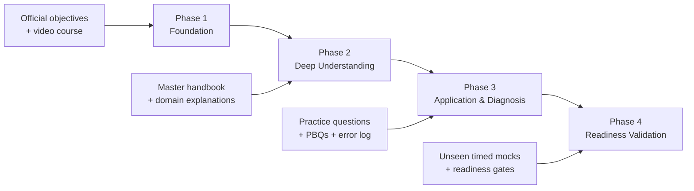

<div align="center">

# CompTIA Security+ SY0-701
## Zero-to-Certified Learning System

**A structured, practical, and ethical cybersecurity programme that transforms the Security+ syllabus into durable professional capability.**

<br>

[](https://www.comptia.org/en-us/certifications/security/)
[](#programme-at-a-glance)
[](#free-and-ethical-practice-resources)
[](https://arharif.github.io/)

<br>

[**Start the video course**](https://www.youtube.com/watch?v=KiEptGbnEBc&list=PLG49S3nxzAnl4QDVqK-hOnoqcSKEIDDuv)
&nbsp;&nbsp;•&nbsp;&nbsp;
[**Read the master handbook**](./resources/Security_Plus_SY0-701_Master_Course_arharif.pdf)
&nbsp;&nbsp;•&nbsp;&nbsp;
[**Practise with free questions**](#free-and-ethical-practice-resources)

<br>

> **Learn deeply. Apply securely. Validate objectively. Certify ethically.**

</div>

---

## Executive Summary

**Security+ Zero-to-Certified** is an eight-week, exam-aligned learning system designed to build both **CompTIA Security+ SY0-701 readiness** and **practical cybersecurity judgement**.

The programme combines:

- A complete free video course for first-pass learning
- A detailed arharif master handbook for deep understanding
- Domain-based practice questions and scenario analysis
- Performance-based question preparation
- A structured error-remediation method
- Readiness gates based on unseen timed mock examinations
- Practical connections to SOC, GRC, IAM, cloud security, incident response, security engineering, and CISO decision-making

This repository is not a collection of exam dumps. It is a controlled learning journey that moves the learner through four stages:

```text
FOUNDATION → UNDERSTANDING → APPLICATION → VALIDATION
```

---

## Programme at a Glance

| Programme dimension | Coverage |
|---|---:|
| **Certification alignment** | CompTIA Security+ SY0-701 |
| **Security domains** | 5 |
| **Recommended duration** | 8 weeks |
| **Strategic learning phases** | 4 |
| **Primary video course** | Professor Messer SY0-701 |
| **Deep-study resource** | arharif Security+ Master Course |
| **Practice approach** | Domain questions, scenarios, PBQs, and timed mocks |
| **Target readiness indicator** | 80–85% on new, unseen practice exams |
| **Professional perspectives** | SOC, engineering, GRC, IAM, incident response, and CISO |
| **Ethical position** | No leaked questions, stolen PBQs, or brain dumps |

---

## Who This Programme Is For

This roadmap is designed for:

- Students beginning cybersecurity
- IT professionals moving into security
- SOC and incident-response candidates
- GRC and risk professionals strengthening technical knowledge
- Cloud, network, and infrastructure engineers
- Security analysts preparing for their first major certification
- Professionals seeking a structured foundation before CISSP, CISM, CySA+, or cloud-security certifications

No previous cybersecurity certification is required. Basic networking and operating-system familiarity will make the journey easier.

---

## The Value Proposition

Most Security+ repositories focus on notes, definitions, or random question banks. This learning system is designed differently.

| Traditional preparation | Zero-to-Certified learning system |
|---|---|
| Memorise terminology | Understand the security and risk logic |
| Repeat random questions | Diagnose weaknesses by exam objective |
| Study tools in isolation | Connect people, process, and technology |
| Focus only on passing | Build reusable professional knowledge |
| Treat GRC and operations separately | Link SOC, engineering, GRC, and CISO decisions |
| Trust repeated-test scores | Validate readiness using unseen timed questions |
| Chase exam dumps | Protect certification integrity |

---

# Four-Phase Learning Journey



## Phase 1 — Establish the Foundation

**Objective:** Understand the complete scope of SY0-701 and build a reliable first-pass knowledge base.

### Core activities

- Review the current CompTIA Security+ exam objectives
- Complete the Professor Messer SY0-701 video course in order
- Build a concise acronym and terminology sheet
- Mark objectives as Red, Amber, or Green
- Avoid full mock examinations before completing the conceptual foundation

### Required output

A complete exam-objectives checklist with every objective reviewed at least once.

---

## Phase 2 — Deepen Understanding

**Objective:** Move from recognition to explanation, comparison, and practical understanding.

### Core activities

- Study the arharif Security+ Master Course
- Revisit unclear objectives in detail
- Connect every major concept to a realistic enterprise example
- Complete end-of-section questions
- Explain why correct answers are correct and alternatives are unsuitable
- Connect technical controls to business risk and operational responsibilities

### Required output

A personal knowledge base covering the five Security+ domains, supported by examples and clear distinctions between similar concepts.

---

## Phase 3 — Apply and Diagnose

**Objective:** Convert knowledge into security judgement.

### Core activities

- Complete questions by domain
- Practise scenario-based multiple-choice questions
- Analyse PBQ-style activities
- Maintain a structured error log
- Treat guessed answers as incorrect
- Revisit weak objectives before attempting more mixed tests

### Required output

A weakness heatmap and remediation plan organised by domain and objective.

---

## Phase 4 — Validate Readiness

**Objective:** Confirm that performance is reliable under realistic examination conditions.

### Core activities

- Complete new, unseen mixed mock examinations
- Use a strict 90-minute limit
- Practise skipping and returning to difficult questions
- Review every incorrect and uncertain answer
- Verify examination rules, identification, scheduling, and technical requirements
- Book the examination only after meeting the readiness gates

### Required output

At least three recent timed mock results supported by an updated error log and a final readiness decision.

---

# Start Here

## 1. Review the Official Examination Scope

Use the current CompTIA Security+ page and official examination objectives as the source of truth.

[](https://www.comptia.org/en-us/certifications/security/)

> [!IMPORTANT]
> Courses, videos, books, and practice platforms are supporting resources. The latest CompTIA-published objectives remain the authoritative scope.

---

## 2. Complete the Professor Messer Video Course

[](https://www.youtube.com/watch?v=KiEptGbnEBc&list=PLG49S3nxzAnl4QDVqK-hOnoqcSKEIDDuv)

### Recommended method

1. Watch the playlist in objective order.
2. Record concise notes rather than transcribing videos.
3. Write one practical example for each important concept.
4. Mark unclear topics as **Red**, partial understanding as **Amber**, and mastery as **Green**.
5. Revisit the corresponding lesson before moving to mixed practice.

---

## 3. Study the arharif Master Handbook

[](./resources/Security_Plus_SY0-701_Master_Course_arharif.pdf)

Store the document at:

```text
resources/Security_Plus_SY0-701_Master_Course_arharif.pdf
```

The handbook is designed to help learners:

- Understand each objective more deeply
- Connect definitions to realistic enterprise situations
- Compare frequently confused technologies and controls
- Understand SOC, engineering, GRC, and CISO perspectives
- Review original questions with explanations
- Build knowledge that remains useful after certification

---

# Security+ Domain Dashboard

| Domain | Weight | Strategic question | Primary capability |
|---|---:|---|---|
| **1. General Security Concepts** | **12%** | What principles and controls form the security foundation? | Security fundamentals and cryptography |
| **2. Threats, Vulnerabilities, and Mitigations** | **22%** | What can attack us, where are we weak, and how do we reduce exposure? | Threat and vulnerability analysis |
| **3. Security Architecture** | **18%** | How should secure and resilient systems be designed? | Architecture and data protection |
| **4. Security Operations** | **28%** | How do we prevent, detect, investigate, respond, and recover? | Operational security and incident response |
| **5. Security Programme Management and Oversight** | **20%** | How is cybersecurity governed, measured, and assured? | Governance, risk, compliance, and oversight |

---

<details>
<summary><strong>Domain 1 — General Security Concepts · 12%</strong></summary>

### Purpose

This domain establishes the language and logic of cybersecurity. It explains what security protects, how controls are classified, how trust is established, and how cryptography supports confidentiality, integrity, authentication, and non-repudiation.

### Core subjects

- Technical, managerial, operational, and physical controls
- Preventive, deterrent, detective, corrective, directive, and compensating controls
- Confidentiality, Integrity, and Availability
- Authentication, Authorisation, and Accounting
- Non-repudiation and Zero Trust
- Change management and gap analysis
- Symmetric and asymmetric encryption
- Hashing, salting, digital signatures, and certificates
- Public Key Infrastructure
- TPM, HSM, tokenisation, masking, and key management

### Practical example

A payroll system protects salary data through:

- **Confidentiality:** only authorised HR staff can view salaries.
- **Integrity:** unauthorised changes are prevented or detected.
- **Availability:** payroll remains accessible when payments are processed.
- **Authentication:** the system verifies the employee's identity.
- **Authorisation:** access is limited according to job responsibilities.
- **Accounting:** sensitive access and changes are logged.

### Evidence of mastery

You should be able to:

- Classify controls by category and function
- Distinguish authentication from authorisation
- Explain encryption, hashing, and digital signatures
- Describe how PKI establishes trust
- Explain the security importance of controlled change
- Select appropriate cryptographic mechanisms for a scenario

</details>

---

<details>
<summary><strong>Domain 2 — Threats, Vulnerabilities, and Mitigations · 22%</strong></summary>

### Purpose

This domain explains who attacks organisations, why they attack, how they enter, which weaknesses they exploit, which indicators they leave, and which mitigations reduce the risk.

### Core subjects

- Nation-state, criminal, insider, hacktivist, and unskilled actors
- Motivations, capabilities, and attack surfaces
- Phishing, smishing, vishing, pretexting, impersonation, and BEC
- Application, operating-system, cloud, hardware, and mobile vulnerabilities
- Injection, XSS, buffer overflow, race conditions, and directory traversal
- Ransomware, trojans, worms, spyware, rootkits, and keyloggers
- DDoS, DNS, wireless, on-path, replay, password, and cryptographic attacks
- Indicators of compromise
- Segmentation, isolation, hardening, patching, monitoring, and least privilege

### Practical example

An employee receives an urgent message appearing to come from the CEO and requesting an immediate transfer.

A mature analysis considers:

1. Executive impersonation
2. Social engineering and urgency
3. Potential email-account compromise
4. Weak payment-verification procedures
5. Missing awareness or reporting controls
6. Email authentication, filtering, and monitoring gaps

The appropriate response combines people, process, and technology.

### Evidence of mastery

You should be able to:

- Distinguish threat, vulnerability, exploit, risk, and control
- Match threat actors to likely motivations
- Recognise suspicious indicators in scenarios and logs
- Select proportionate mitigations
- Distinguish preventive, detective, and corrective actions
- Explain why patching alone does not eliminate all risk

</details>

---

<details>
<summary><strong>Domain 3 — Security Architecture · 18%</strong></summary>

### Purpose

This domain focuses on designing secure, resilient, scalable, and recoverable environments across on-premises, cloud, hybrid, virtualised, containerised, mobile, IoT, and industrial systems.

### Core subjects

- On-premises, cloud, hybrid, serverless, and microservices
- Virtualisation, containers, IoT, ICS, SCADA, and embedded systems
- High availability, resilience, recovery, and scalability
- Segmentation, security zones, jump servers, proxies, and sensors
- Firewalls, WAFs, IDS/IPS, load balancers, and secure access
- VPN, TLS, IPsec, SD-WAN, and SASE
- Fail-open and fail-closed design
- Data classification, sovereignty, geolocation, and lifecycle
- Data at rest, in transit, and in use
- Encryption, masking, tokenisation, access restriction, and backup

### Practical example

A payment platform requires more than one firewall.

A resilient architecture may include:

- Segmentation between public, application, and database zones
- A WAF in front of internet-facing applications
- Strong administrator identity controls
- Encryption for sensitive data
- Centralised logging and monitoring
- Redundant services across availability zones
- Tested backups and recovery objectives
- Controlled third-party access

### Evidence of mastery

You should be able to:

- Select appropriate control placement
- Explain cloud shared responsibility
- Distinguish high availability, backup, and disaster recovery
- Match data states with suitable protections
- Explain segmentation, isolation, and Zero Trust architecture
- Analyse architectural trade-offs and constraints

</details>

---

<details>
<summary><strong>Domain 4 — Security Operations · 28%</strong></summary>

### Purpose

This is the largest domain. It explains how cybersecurity is operated every day through hardening, monitoring, vulnerability management, identity administration, investigation, incident response, automation, forensics, and recovery.

### Core subjects

- Secure baselines, patching, configuration management, and hardening
- Asset inventory and lifecycle management
- Vulnerability scanning, prioritisation, remediation, and validation
- SIEM, SOAR, EDR, DLP, IDS/IPS, and network monitoring
- Logs, alerts, dashboards, packet captures, and metadata
- Provisioning, deprovisioning, SSO, federation, MFA, and PAM
- Automation and orchestration
- Incident-response lifecycle
- Digital evidence, chain of custody, and legal hold
- Backup restoration, continuity, and recovery testing

### Practical example

An EDR alert reports PowerShell launching an encoded command on an executive laptop.

A mature analyst should:

1. Validate the alert and gather context.
2. Determine whether the activity is authorised.
3. Review process trees, connections, users, and related alerts.
4. Assess scope and business impact.
5. Contain the endpoint when justified.
6. Preserve relevant evidence.
7. Eradicate the cause and recover securely.
8. Document lessons learned and control improvements.

### Evidence of mastery

You should be able to:

- Interpret common logs and alerts
- Prioritise vulnerabilities using technical and business context
- Describe the incident-response lifecycle in the correct sequence
- Distinguish containment, eradication, and recovery
- Explain privileged access and identity lifecycle controls
- Select appropriate monitoring and protection technologies
- Preserve evidence and maintain chain of custody

</details>

---

<details>
<summary><strong>Domain 5 — Security Programme Management and Oversight · 20%</strong></summary>

### Purpose

This domain connects cybersecurity to governance and business management. It explains how organisations define expectations, manage risk, oversee third parties, maintain compliance, educate employees, and validate control effectiveness.

### Core subjects

- Policies, standards, procedures, guidelines, and governance
- Roles, responsibilities, accountability, and segregation of duties
- Risk identification, analysis, treatment, acceptance, transfer, and avoidance
- Risk appetite, tolerance, inherent risk, residual risk, and KRIs
- Business impact analysis
- Third-party due diligence, contracts, monitoring, and offboarding
- Legal, regulatory, contractual, privacy, and compliance requirements
- Audits, assessments, attestations, certifications, and penetration testing
- Security awareness and role-based training
- Business continuity, disaster recovery, and crisis management
- Exceptions, compensating controls, and risk acceptance

### Practical example

A critical legacy system cannot support MFA.

A mature organisation should:

1. Document the control gap.
2. Assess likelihood and business impact.
3. Identify feasible compensating controls.
4. Assign a risk owner.
5. Approve a time-limited exception.
6. Monitor residual risk.
7. Create a remediation or replacement roadmap.
8. Review the exception before expiry.

### Evidence of mastery

You should be able to:

- Distinguish policies, standards, procedures, and guidelines
- Explain qualitative and quantitative risk
- Interpret risk appetite, tolerance, inherent risk, and residual risk
- Select third-party controls across the supplier lifecycle
- Distinguish audits, assessments, attestations, and penetration tests
- Connect security decisions to business objectives and accountability

</details>

---

# Eight-Week Delivery Plan

| Week | Focus | Key activities | Required output |
|---|---|---|---|
| **1** | General security concepts | Controls, CIA, AAA, Zero Trust, cryptography, and PKI | Control taxonomy and cryptography summary |
| **2** | Threat actors and vectors | Actors, motivations, social engineering, and attack surfaces | Threat-to-control mapping |
| **3** | Vulnerabilities and mitigations | Application, network, endpoint, cloud, and malware scenarios | Attack and remediation matrix |
| **4** | Security architecture | Cloud, segmentation, resilience, data protection, and secure design | Secure architecture diagram |
| **5** | Security operations | Hardening, vulnerability management, monitoring, IAM, and incident response | Operational security workflow |
| **6** | Programme management | Governance, risk, third parties, compliance, awareness, and continuity | Risk entry and governance hierarchy |
| **7** | Integrated practice | Mixed questions, PBQs, error analysis, and targeted revision | Weakness heatmap and remediation plan |
| **8** | Final validation | Timed mocks, logistics, readiness review, and final revision | Evidence-based exam decision |

---

# Certification Readiness Gates

Do not assess readiness through confidence alone. Use measurable exit criteria.

| Gate | Exit criterion |
|---|---|
| **G1 — Coverage** | Every official exam objective has been reviewed |
| **G2 — Comprehension** | Each major objective can be explained without notes |
| **G3 — Application** | Scenario questions can be answered with defensible reasoning |
| **G4 — Remediation** | Red and Amber objectives have documented corrective study actions |
| **G5 — Performance** | Consistent 80–85% results on new, unseen mixed mock exams |
| **G6 — Examination readiness** | Timing, PBQ strategy, identity, scheduling, and examination rules are confirmed |

> [!CAUTION]
> No practice score guarantees a pass. Repeated tests can measure memory rather than competence. New and unseen questions provide stronger readiness evidence.

---

# Free and Ethical Practice Resources

| Platform | Free resource | Best use | Recommended stage |
|---|---|---|---|
| **Professor Messer Course Index** | [Free SY0-701 course](https://www.professormesser.com/security-plus/sy0-701/sy0-701-video/sy0-701-comptia-security-plus-course/) | Find lessons by exact exam objective | All phases |
| **Professor Messer Study Groups** | [Study-group archive](https://www.professormesser.com/category/security-plus/sy0-701/sy0-701-study-group/) | Scenario questions with detailed reasoning | Phases 2–4 |
| **Professor Messer Pop Quizzes** | [SY0-701 pop quizzes](https://www.professormesser.com/category/security-plus/sy0-701/sy0-701-pop-quiz/) | Short daily reinforcement | Phases 2–3 |
| **ExamCompass** | [Free Security+ practice tests](https://www.examcompass.com/comptia/security-plus-certification/free-security-plus-practice-tests) | Topic questions, acronyms, and recall | After each domain |
| **Crucial Exams** | [SY0-701 practice questions](https://crucialexams.com/exams/comptia/security/sy0-701/practice-tests-practice-questions) | Mixed practice, flashcards, and selected simulations | Phases 3–4 |

Access conditions may change. Always verify that the selected question bank is aligned with **SY0-701**.

---

# How to Analyse a Practice Question

For every question:

1. Identify whether it asks for the **best**, **first**, **next**, **most likely**, or **most secure** answer.
2. Separate relevant facts from distracting information.
3. Identify the underlying domain and objective.
4. Eliminate answers that are true but do not solve the stated problem.
5. Select the answer that best matches the required priority.
6. Review the explanation even when your answer is correct.
7. Record guessed or uncertain answers in the error log.

### Example

**Scenario:** Active ransomware encryption is detected on several endpoints. What should the security team do first?

Restoring from backup is important, but it is not normally the first action while the threat is actively spreading.

The immediate operational priority is usually **containment**, such as isolating affected endpoints. Restoration belongs to the recovery phase after containment and eradication decisions.

Security+ frequently tests the correct **sequence and priority**, not only terminology.

---

# Error-Remediation Method

Use the following structure:

| Date | Domain | Objective | Question summary | Error type | Correct principle | Remediation action |
|---|---|---|---|---|---|---|
| YYYY-MM-DD | 4 | 4.x | Ransomware response | Sequence error | Contain before recovery | Review incident-response lifecycle and retest |

## Error categories

- **Knowledge gap:** The concept was unknown.
- **Terminology confusion:** Two related concepts were mixed.
- **Scenario error:** The concepts were known but incorrectly applied.
- **Sequence error:** The correct action was selected at the wrong stage.
- **Keyword error:** “First,” “best,” or “most appropriate” was missed.
- **Guess:** The correct answer was selected without reliable reasoning.
- **Time pressure:** The question was rushed or overanalysed.

Treat guessed answers as incorrect until the reasoning is understood.

---

# The arharif Learning Method

```text
LEARN → EXPLAIN → APPLY → TEST → REVIEW → RETEST
```

## Learn

Watch the relevant lesson and read the corresponding handbook section.

## Explain

Without notes, answer:

- What is it?
- Why does it exist?
- What risk does it address?
- How does it work?
- When should it be used?
- What are its limitations?
- Which similar concept could be confused with it?

## Apply

Create a realistic organisational scenario and select appropriate controls.

## Test

Complete questions mapped to the objective.

## Review

Analyse incorrect, guessed, and uncertain answers.

## Retest

Return to the objective and complete a new set of questions.

---

# Optional Practical Reinforcement

Security+ is not a penetration-testing certification, but practical experience improves understanding.

Safe activities include:

- Analyse Windows and Linux authentication logs
- Review firewall allow and deny rules
- Compare HTTP and HTTPS
- Inspect a TLS certificate
- Build an asset inventory
- Create a vulnerability-remediation workflow
- Configure MFA in a test account
- Draw a segmented enterprise network
- Write a phishing-incident procedure
- Create a risk-register entry
- Conduct a tabletop ransomware exercise
- Test backup restoration in an authorised lab

> [!WARNING]
> Perform technical exercises only on systems you own or are explicitly authorised to test.

---

# Master Progress Tracker

## Foundation

- [ ] I reviewed the current SY0-701 exam scope.
- [ ] I completed the Professor Messer video course.
- [ ] I completed the arharif Security+ Master Course.
- [ ] I created an acronym and terminology sheet.
- [ ] I created an error log.

## Domains

- [ ] Domain 1 — General Security Concepts
- [ ] Domain 2 — Threats, Vulnerabilities, and Mitigations
- [ ] Domain 3 — Security Architecture
- [ ] Domain 4 — Security Operations
- [ ] Domain 5 — Security Programme Management and Oversight

## Applied understanding

- [ ] I can explain CIA and AAA using realistic examples.
- [ ] I can distinguish encryption, hashing, and digital signatures.
- [ ] I can identify common attacks and select proportionate mitigations.
- [ ] I can analyse basic logs and alerts.
- [ ] I can explain incident response in the correct sequence.
- [ ] I can explain MFA, SSO, federation, RBAC, and PAM.
- [ ] I can prioritise vulnerabilities using business context.
- [ ] I can distinguish governance documents and assurance activities.
- [ ] I can explain inherent risk, residual risk, and risk treatment.
- [ ] I can connect technical controls to business objectives.

## Readiness

- [ ] Every official objective has been reviewed.
- [ ] Red and Amber objectives have been remediated.
- [ ] I consistently achieve 80–85% on unseen mixed tests.
- [ ] I complete practice exams within the time limit.
- [ ] I review guessed answers as incorrect.
- [ ] I can approach PBQ-style scenarios methodically.
- [ ] I understand why incorrect alternatives are unsuitable.
- [ ] I am not relying on memorised question banks.

---

# Content Quality Framework

Every resource or contribution should satisfy the **ARPE Framework**:

| Principle | Requirement |
|---|---|
| **Aligned** | Maps to current SY0-701 objectives |
| **Reliable** | Uses technically defensible and current information |
| **Practical** | Connects knowledge to realistic security decisions |
| **Ethical** | Does not reproduce protected examination material |

---

# Content Governance

## Current edition

```text
Edition: 2026.1
Exam alignment: CompTIA Security+ SY0-701
Last content review: August 2026
Maintainer: Anass Rharif
```

The repository should be reviewed when:

- CompTIA changes examination objectives or policies
- A major linked resource becomes unavailable
- Technical guidance becomes outdated
- A validated accuracy issue is reported
- The master handbook is updated

---

# Repository Structure

```text
security-plus-sy0-701-roadmap/
├── README.md
├── resources/
│   └── Security_Plus_SY0-701_Master_Course_arharif.pdf
└── LICENSE
```

The repository can remain intentionally simple. The README provides the learning system, and the `resources` directory contains the deep-study handbook.

---

# Maintainer

**Anass Rharif — Cybersecurity, GRC, and AI Research**

This repository is maintained as an independent cybersecurity education initiative focused on making technical knowledge structured, practical, ethical, and accessible.

- Portfolio: [arharif.github.io](https://arharif.github.io/)
- GitHub: [github.com/arharif](https://github.com/arharif)

---

# Contributions

Constructive contributions are welcome when they:

- Improve technical accuracy
- Clarify a difficult concept
- Add legal and reputable free resources
- Correct outdated or broken links
- Improve accessibility or readability
- Add original study material aligned with SY0-701

Do not submit:

- Exam dumps
- Recalled live-exam questions
- Stolen PBQs
- Confidential examination content
- Copyrighted material without permission

---

# Exam Integrity

This repository supports ethical certification preparation.

A certification has professional value only when it represents genuine knowledge and responsible conduct. Learners should use legitimate courses, original practice material, authorised laboratories, and official examination guidance.

---

# Disclaimer

**© 2026 arharif. All rights reserved.**

This repository is an independent educational initiative. CompTIA, Security+, and associated marks are trademarks of CompTIA, Inc. This repository is not affiliated with, endorsed by, or sponsored by CompTIA.

External resources remain the property of their respective authors and organisations. Links are provided for educational reference, and their availability or access conditions may change.

---

<div align="center">

## Learn deeply. Practise ethically. Think like a security professional.

[](https://www.youtube.com/watch?v=KiEptGbnEBc&list=PLG49S3nxzAnl4QDVqK-hOnoqcSKEIDDuv)
[](./resources/Security_Plus_SY0-701_Master_Course_arharif.pdf)
[](https://arharif.github.io/)

</div>
